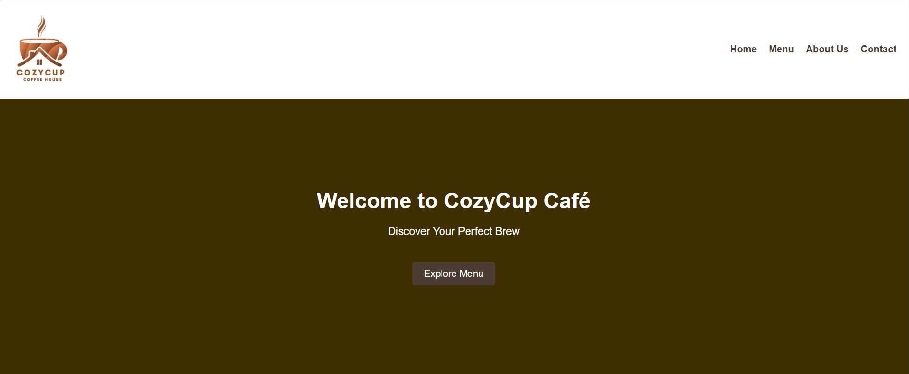
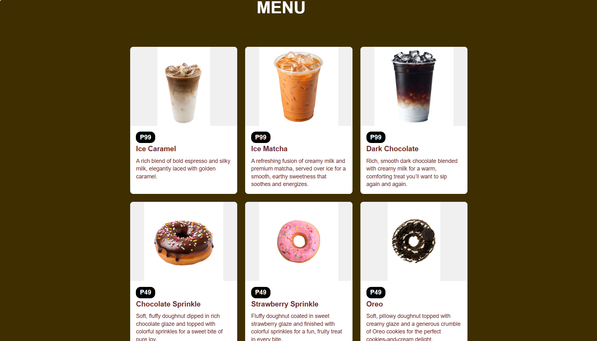
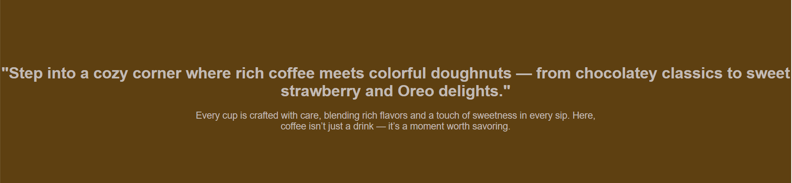
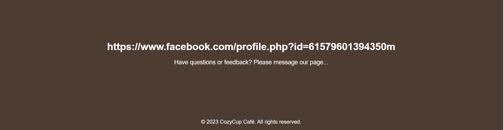

# Cozy Cup Cafe

## Project Description
CozyCup Café is where every sip feels like home. Step inside and be greeted by the gentle hum of conversations, the rich scent of roasted coffee, and the warmth of a space designed for comfort. With a blend of modern elegance and cozy charm, it’s the perfect spot to enjoy coffee, flavorful pastries, and moments that matter. Whether you’re here to focus, unwind, or simply savor the day, CozyCup Café brews more than coffee—it brews memories.

## Features 
<ul>
    
Menu:

    <li> Drinks: Caramel Machiato, Matcha Latte and Dark Chocolate. </li> 
    <li> Doughnut: Chocolate Sprinkle, Strawberry Sprinkle and Oreo. </li> 
    
About Us

    <li>Step into a cozy corner where rich coffee meets colorful doughnuts — from chocolatey classics to sweet strawberry and Oreo delights.</li> 
    <li>Every cup is crafted with care, blending rich flavors and a touch of sweetness in every sip. Here, coffee isn’t just a drink — it’s a moment worth savoring. </li> 
    
Contacts:

    <li>Have questions or feedback? Please message our page, also a contact for reservation like Special gathering etc. </li> 
</ul>

## Screen Captures

This image is the heading or start of our project Cafe

 

The second is the menu of our Cafe

 

This third show the "about the cafe"

 
  

This last image is for our contact page

 

## About the Authors

**Name:** Kimly Mark Bron  
**Email:** 202380269@psu.palawan.edu.ph

<a href="https://www.facebook.com/kimlymark.bron.3">
  

---

**Name:** John Christopher Remandaban  
**Email:** 202380127@psu.palawan.edu.ph

<a href="https://www.facebook.com/jc.remandaban.2024">
  

